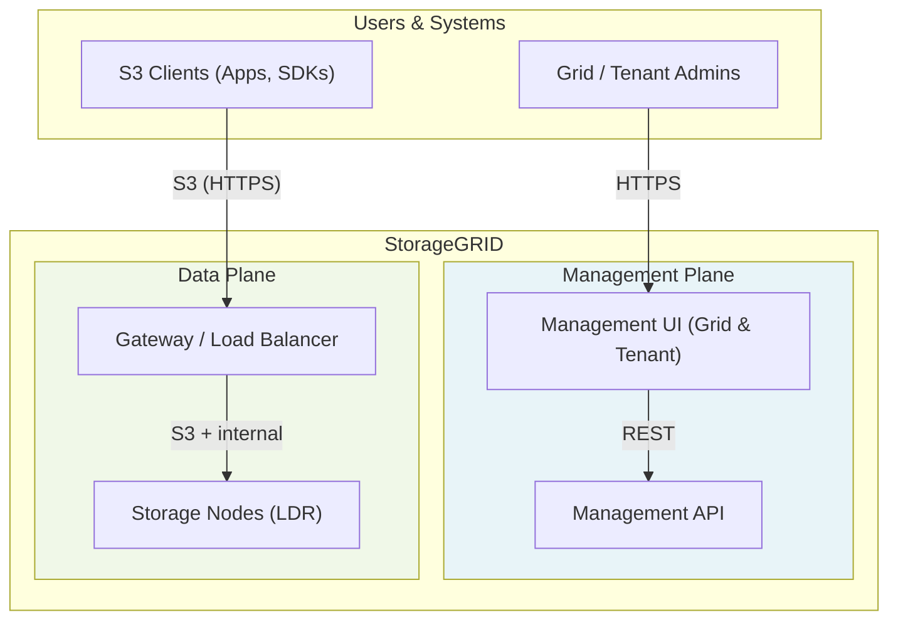
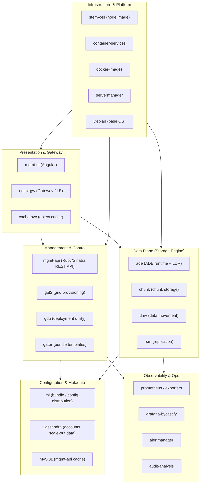
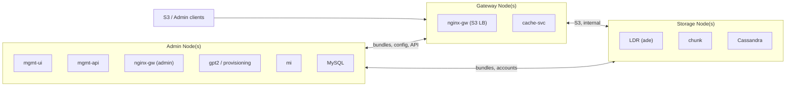
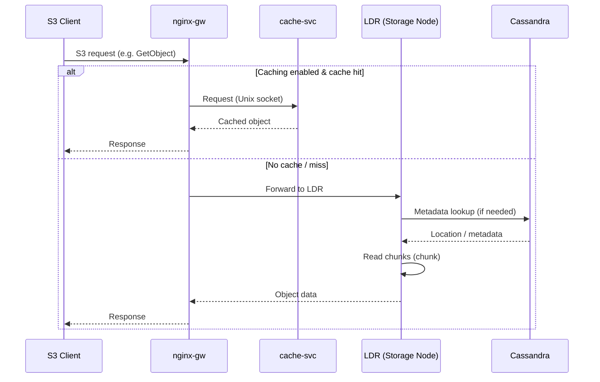

# StorageGRID Repository — Architecture Overview

This document gives a **high-level, visual overview** of the StorageGRID codebase for leadership (Director/VP) and anyone who needs to understand how the system fits together at a glance.

---

## Executive Summary

**StorageGRID** is an object storage system (S3-compatible) that runs as a distributed grid. The repository contains the full stack: management UIs and APIs, gateway and load-balancing, the core storage engine, metadata and configuration stores, and the tooling to provision and operate the grid.

At the highest level:

- **Users and applications** talk to the grid in two ways: **S3 (data path)** for storing and retrieving objects, and **Management UI/API** for administration and tenant configuration.
- The grid is made of **three node types**: **Admin** (management and control), **Gateway** (S3 entry point and load balancing), and **Storage** (object and metadata storage).
- **Configuration** is distributed via **bundles** and scaled-out data (e.g. tenant accounts) lives in **Cassandra**. The **management API** is the single source of truth for grid and tenant configuration, backed by MySQL (cache) and external services.
- The **base OS** for grid nodes is **Debian**; node images and container workloads are built on top of it.

The diagrams below show how these pieces connect.

---

## 1. System Context — Who Uses What



**Takeaway:** Two main entry points — **Management** (UI + API) for people and automation, **Data plane** (Gateway → Storage) for S3 object traffic.

---

## 2. Layered Architecture — Repo at a Glance



**Takeaway:** Clear layers from **Presentation** (UI and gateways) down to **Management**, **Config/Metadata**, **Data plane**, with **Observability** and **Infrastructure** supporting the whole system.

---

## 3. Node Types and Where Components Run



| Node Type      | Role | Key Repo Components (conceptually) |
|----------------|------|-------------------------------------|
| **Admin**      | Grid and tenant management, provisioning, config distribution | mgmt-ui, mgmt-api, nginx-gw, gpt2, gdu, gator, mi, MySQL |
| **Gateway**    | S3 entry point, load balancing, optional object cache | nginx-gw, cache-svc |
| **Storage**    | Object and metadata storage, replication, ILM | ade (LDR), chunk, Cassandra (cassandra-bycastify), dmv, rsm |

**Takeaway:** Admin = “brain” and API; Gateway = “front door” for S3; Storage = “data and metadata” on disk and in Cassandra.

---

## 4. S3 Data Path (Simplified)



**Takeaway:** S3 traffic hits **nginx-gw**; **cache-svc** can serve cached GetObject on gateway nodes; otherwise requests go to **LDR** on storage nodes, which use **Cassandra** and **chunk** storage.

---

## 5. Key Repository Components by Category

| Category | Components (examples) | Purpose |
|----------|------------------------|--------|
| **Management** | mgmt-ui, mgmt-api | Web UI and REST API for grid and tenant admin |
| **Gateway / Data path** | nginx-gw, cache-svc | S3 entry, load balancing, optional object cache |
| **Storage engine** | ade, chunk, dmv, rsm | LDR, chunk I/O, data movement, replication |
| **Config & metadata** | mi, gator, gpt2, cassandra-bycastify | Bundles, provisioning, scale-out metadata (e.g. accounts) |
| **Provisioning & deploy** | gpt2, gdu, stem-cell | Grid provisioning, deployment, node images |
| **Observability** | prometheus, prometheus-exporters, grafana-bycastify, alertmanager, audit-analysis | Metrics, dashboards, alerts, audit log parsing |
| **Platform / infra** | container-services, docker-images, servermanager, sga-base-os | Containers, images, node lifecycle; **Debian** as base OS |
| **Optional / integration** | s3-select, lambda-arbitrator | S3 Select, Lambda-style processing |

This table is a **simplified map** of the repo; many other components (e.g. bel, btl, dse, idnt, leakd, mailer, snmp, upgrade) support specific features or node services and are omitted here for brevity.

---

## 6. How to Use This Document

- **Presentations:** Use the Mermaid diagrams in Section 1–4 (they render in GitHub, GitLab, many Confluence setups, and Mermaid-compatible slide tools).
- **Onboarding:** Start with the Executive Summary and Section 2 (Layered Architecture), then Section 3 (Node Types).
- **Deep dives:** Use Section 5 and the READMEs in each component (`mgmt-api`, `ade`, `nginx-gw`, `cache-svc`, `gpt2`, etc.) for implementation details.

For detailed architecture discussions (e.g. datapath evolution), see internal design docs and the Architecture Working Group materials referenced in component READMEs (e.g. cache-svc).

### Viewing in a browser (with diagrams rendered)

To view this document in a browser with all Mermaid diagrams rendered:

1. **Option A — Local viewer (repo root):** From the repository root, start a simple HTTP server, then open the viewer page:
   ```bash
   # From the storagegrid repo root:
   python3 -m http.server 8000
   ```
   Then open in your browser: **http://localhost:8000/view-architecture.html**

   Alternatively: `npx serve .` then open **http://localhost:3000/view-architecture.html**

2. **Option B — GitHub / GitLab:** Push the repo and view `ARCHITECTURE.md` on the web; Mermaid fenced code blocks render as diagrams automatically.
